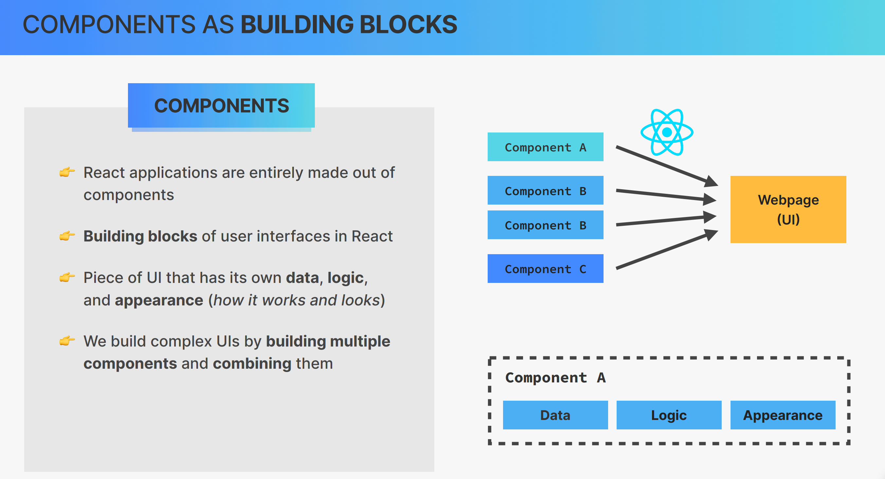
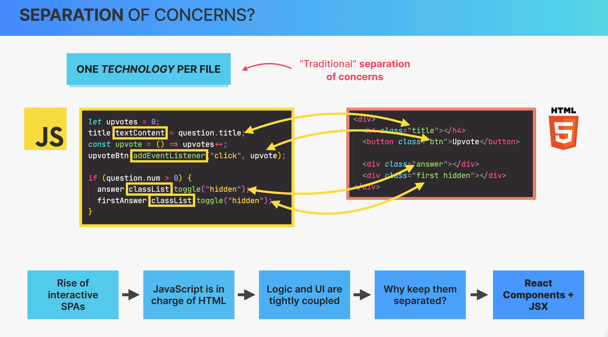
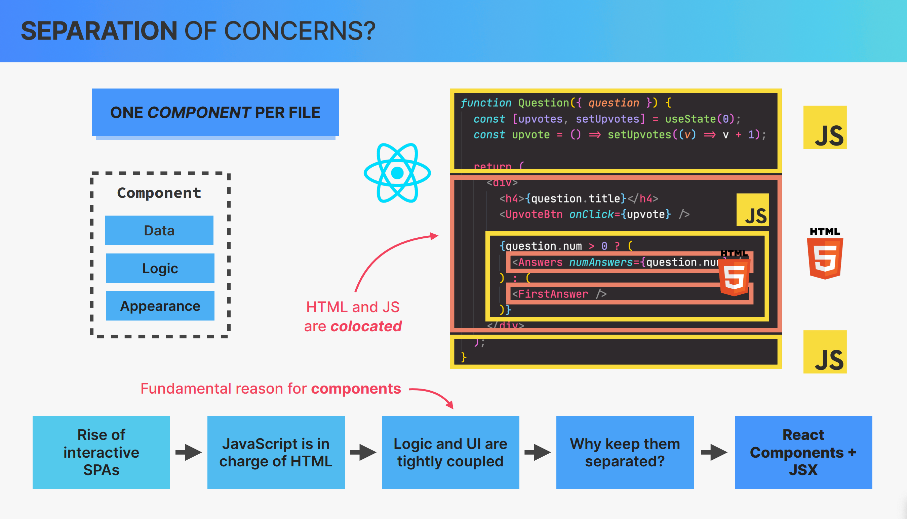
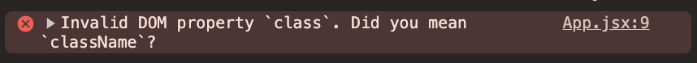
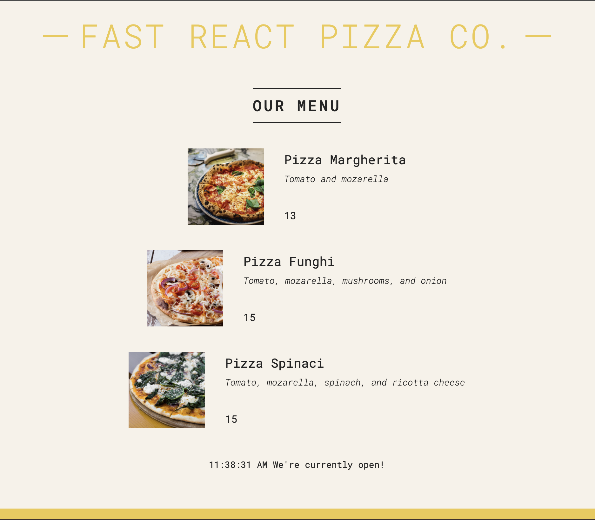
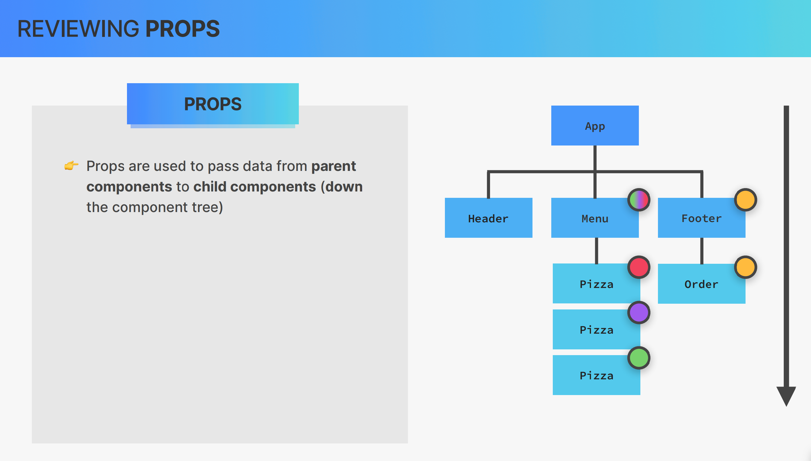
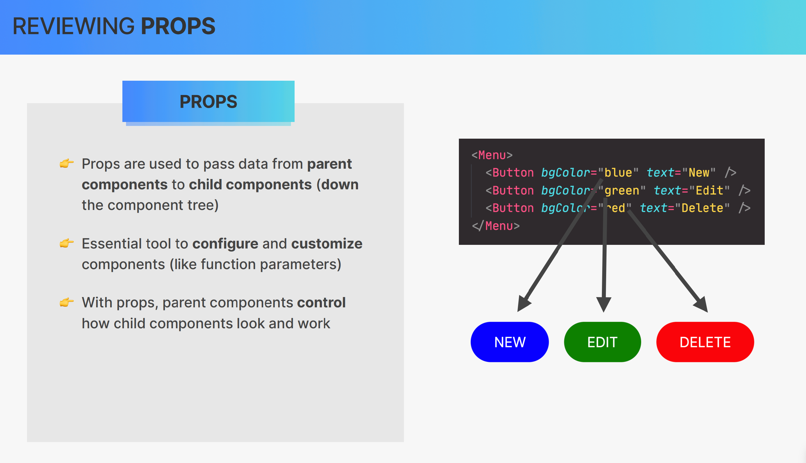
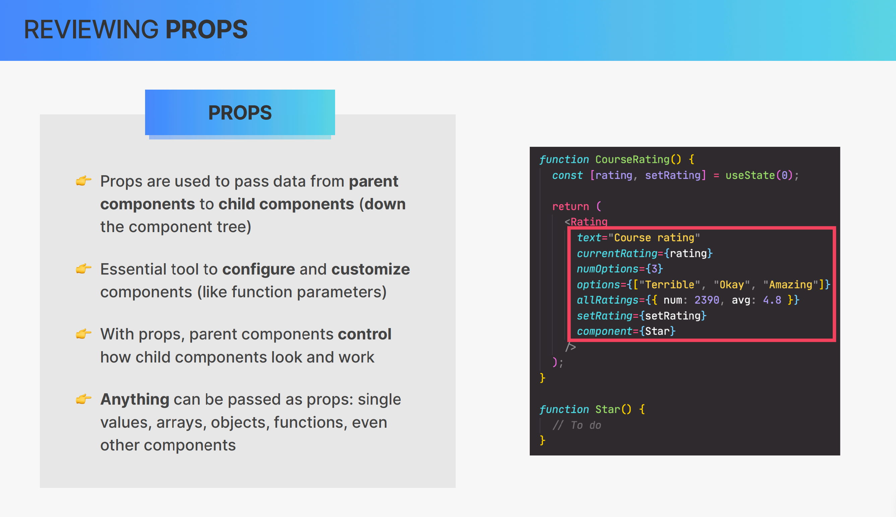
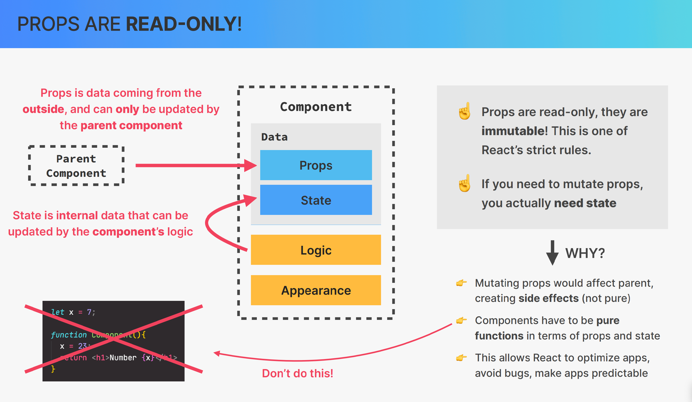
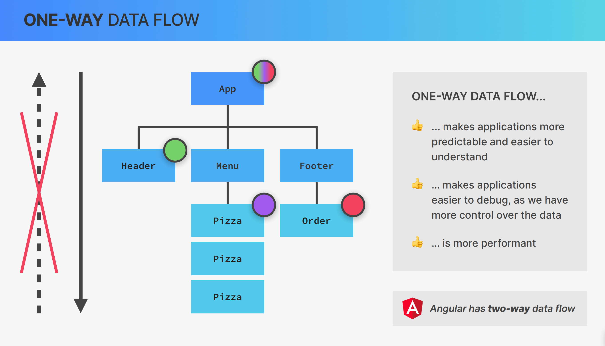

# 👨🏾‍💻 Project: Fast React Pizza Co.

## 📋 Project Overview

### What This Project Does

- A **pizza ordering menu** built with React as part of Jonas Schmedtmann's React course (Section 05).
- Displays a dynamic list of pizzas with images, names, ingredients, and prices using component composition.
- Shows **open/closed status** based on business hours using JavaScript date logic.
- Demonstrates **conditional rendering** based on menu availability and restaurant operating hours.
- Implements **component decomposition**: Header, Menu, Footer, and Pizza components.
- Covers core React concepts: JSX, props, immutability, one-way data flow, list rendering, and styling approaches.

### Technology Stack

- **React** 19.1 — UI library for building component-based interfaces.
- **Vite** 7.1 — Fast build tool and development server with HMR.
- **JavaScript (JSX)** — Component logic and markup.
- **CSS** — External stylesheet (`index.css`) for global styling.
- **ESLint** — Code linting and quality enforcement.

### Key Components

| Component | File | Description |
|---|---|---|
| `App` | `src/App.jsx` | Main layout orchestrator — composes Header, Menu, and Footer. |
| `Header` | `src/components/Header.jsx` | Displays the restaurant name and branding. |
| `Menu` | `src/components/Menu.jsx` | Renders the pizza list from a data array using `map()`. |
| `Pizza` | `src/components/pizza.jsx` | Individual pizza card with image, name, ingredients, and price. |
| `Footer` | `src/components/Footer.jsx` | Business hours logic and order section with conditional rendering. |
| Entry Point | `src/main.jsx` | React 18+ bootstrapping with `createRoot` and `StrictMode`. |

## 📑 Table of Contents

- [👨🏾‍💻 Project: Fast React Pizza Co.](#-project-fast-react-pizza-co)
  - [📋 Project Overview](#-project-overview)
  - [📑 Table of Contents](#-table-of-contents)
  - [📁 Visual Project Tree](#-visual-project-tree)
  - [🧳 Section 05: *Working with Components, Props and JSX*](#-section-05-working-with-components-props-and-jsx)
    <details>
    <summary>Section 05 - Lessons</summary>

      * [📚 Lesson 033: Rendering the Root Component and Strict Mode](#-033-lesson-033--rendering-the-root-component-and-strict-mode)
      * [📚 Lesson 034: Before We Start Coding: Debugging](#-034-lesson-034--before-we-start-coding-debugging)
      * [📚 Lesson 035: Components as Building Blocks](#-035-lesson-035--components-as-building-blocks)
      * [📚 Lesson 036: Creating And Reusing a Component](#-036-lesson-036--creating-and-reusing-a-component)
      * [📚 Lesson 037: What is JSX?](#-037-lesson-037--what-is-jsx)
      * [📚 Lesson 038: Creating More Components](#-038-lesson-038--creating-more-components)
      * [📚 Lesson 039: JavaScript Logic in Components](#-039-lesson-039--javascript-logic-in-components)
      * [📚 Lesson 040: Separation of Concerns](#-040-lesson-040--separation-of-concerns)
      * [📚 Lesson 041: Styling React Applications](#-041-lesson-041--styling-react-applications)
      * [📚 Lesson 042: Passing and Receiving Props](#-042-lesson-042--passing-and-receiving-props)
      * [📚 Lesson 043: Props, Immutability, and One-Way Data Flow](#-043-lesson-043--props-immutability-and-one-way-data-flow)
      * [📚 Lesson 046: Rendering Lists](#-046-lesson-046--rendering-lists)
      * [📚 Lesson 047: Conditional Rendering With &&](#-047-lesson-047--conditional-rendering-with-)
      * [📚 Lesson 048: Conditional Rendering With Ternaries](#-048-lesson-048--conditional-rendering-with-ternaries)
    </details>

## 📁 Visual Project Tree

```
📁 03-pizza-menu/
├── 📁 docs/
│   └── 📄 STEPS_LECTURES.md           # Educational content and lecture notes
├── 📁 img/                             # Lecture slide screenshots
│   └── 📄 *.png                        # Section/lecture reference images
├── 📁 public/
│   └── 📁 pizzas/                      # Pizza images (static assets)
│       ├── 📄 focaccia.jpg
│       ├── 📄 funghi.jpg
│       ├── 📄 margherita.jpg
│       ├── 📄 prosciutto.jpg
│       ├── 📄 salamino.jpg
│       └── 📄 spinaci.jpg
├── 📁 src/
│   ├── 📁 components/
│   │   ├── 📄 Footer.jsx              # Footer with business hours logic
│   │   ├── 📄 Header.jsx              # Header with restaurant name
│   │   ├── 📄 Menu.jsx                # Menu with pizza list rendering
│   │   └── 📄 pizza.jsx               # Individual pizza card component
│   ├── 📄 App.jsx                     # Main application component (layout)
│   ├── 📄 index.css                   # Global stylesheet
│   └── 📄 main.jsx                    # Entry point (React 18+ bootstrap)
├── 📄 eslint.config.js                # ESLint configuration
├── 📄 index.html                      # HTML template with #root element
├── 📄 package.json                    # Dependencies and scripts
├── 📄 vite.config.js                  # Vite bundler configuration
└── 📄 README.md                       # Project documentation
```

---

## 🧳 Section 05: *Working with Components, Props and JSX*

### 📑 Table of Contents

- [📚 Lesson 033: Rendering the Root Component and Strict Mode](#-033-lesson-033--rendering-the-root-component-and-strict-mode)
- [📚 Lesson 034: Before We Start Coding: Debugging](#-034-lesson-034--before-we-start-coding-debugging)
- [📚 Lesson 035: Components as Building Blocks](#-035-lesson-035--components-as-building-blocks)
- [📚 Lesson 036: Creating And Reusing a Component](#-036-lesson-036--creating-and-reusing-a-component)
- [📚 Lesson 037: What is JSX?](#-037-lesson-037--what-is-jsx)
- [📚 Lesson 038: Creating More Components](#-038-lesson-038--creating-more-components)
- [📚 Lesson 039: JavaScript Logic in Components](#-039-lesson-039--javascript-logic-in-components)
- [📚 Lesson 040: Separation of Concerns](#-040-lesson-040--separation-of-concerns)
- [📚 Lesson 041: Styling React Applications](#-041-lesson-041--styling-react-applications)
- [📚 Lesson 042: Passing and Receiving Props](#-042-lesson-042--passing-and-receiving-props)
- [📚 Lesson 043: Props, Immutability, and One-Way Data Flow](#-043-lesson-043--props-immutability-and-one-way-data-flow)
- [📚 Lesson 046: Rendering Lists](#-046-lesson-046--rendering-lists)
- [📚 Lesson 047: Conditional Rendering With &&](#-047-lesson-047--conditional-rendering-with-)
- [📚 Lesson 048: Conditional Rendering With Ternaries](#-048-lesson-048--conditional-rendering-with-ternaries)

<br>

## 🔧 033. Lesson 033 — *Rendering the Root Component and Strict Mode*

[🧳 Section 05: *Working with Components, Props and JSX*](#-section-05-working-with-components-props-and-jsx)

### 📑 Table of Content:
- [033. Lesson 033: - *Rendering the Root Component and Strict Mode*](#-033-lesson-033--rendering-the-root-component-and-strict-mode)
- [033.1 Context](#-0331-context)
- [033.2 Updating code/theory according the context](#️-0332-updating-codetheory-according-the-context)
  - [033.2.1 Project Structure](#-03321-project-structure)
  - [033.2.2 Entry Point — `main.jsx`](#-03322-entry-point--mainjsx)
- [033.3 Issues](#-0333-issues)
- [033.4 Pending Fixes (TODO)](#-0334-pending-fixes-todo)

### 🧠 033.1 Context:

Every React application requires a **root component** and an **entry point** that mounts it into the DOM. This lesson covers how React 18+ uses the `createRoot` API and how `StrictMode` helps catch common mistakes during development.

**Key Concepts:**

1. **`createRoot`** — The modern React 18+ API (from `react-dom/client`) that creates a root DOM node to render the React component tree.
2. **`StrictMode`** — A development-only wrapper component that activates additional checks and warnings (double-invokes render functions, lifecycle methods, etc.) to surface potential issues.
3. **Entry Point (`main.jsx`)** — The first file executed by the bundler (Vite), responsible for mounting the React tree into the HTML `#root` element.
4. **Root Element** — The DOM element (`<div id="root">`) in `index.html` where the entire React application is injected.

**Advantages:**

- `StrictMode` helps detect unsafe lifecycles, legacy API usage, and unexpected side effects early in development.
- `createRoot` enables concurrent features introduced in React 18.
- Clear separation between the entry point (`main.jsx`) and the application logic (`App.jsx`).

**Disadvantages / Gotchas:**

- `StrictMode` causes components to render **twice** in development, which can be confusing when reading `console.log` output.
- `StrictMode` has **no effect in production** builds — it is purely a development aid.
- Forgetting the `#root` element in `index.html` results in a runtime crash.

**When to Consider Alternatives:**

- If migrating from React 17 or earlier, the legacy `ReactDOM.render()` API is still available but deprecated.
- For server-side rendering (SSR), use `hydrateRoot` instead of `createRoot`.

### ⚙️ 033.2 Updating code/theory according the context:

#### **Summary**

- This section bootstraps the project from scratch using Vite + React.
- The project structure establishes the conventional folder layout (`public/`, `src/`, config files).
- The `main.jsx` entry point mounts the `App` component inside `StrictMode` into the DOM root.

#### 🗂️ 033.2.1 Project Structure

**Subsection Summary**

- Defines the initial folder and file layout for the pizza-menu project.
- Follows Vite conventions with `src/` for source code, `public/` for static assets, and root-level config files.
- The `App.jsx` and `main.jsx` are the two core files at this stage.

```
03-pizza-menu/
├── public/
├── src/
│   ├── App.jsx                   # Main application component
│   └── main.jsx                  # Application entry point
├── eslint.config.js              # ESLint configuration
├── package.json                  # Project dependencies and scripts
├── vite.config.js                # Vite configuration
└── README.md                     # This file
```

#### 📄 033.2.2 Entry Point — `main.jsx`

**Subsection Summary**

- Imports `StrictMode` from React and `createRoot` from `react-dom/client`.
- Selects the `#root` DOM element and renders the `App` component wrapped in `StrictMode`.
- This is the standard React 18+ bootstrapping pattern using Vite.

```jsx
import { StrictMode } from "react";
import { createRoot } from "react-dom/client";
import App from "./App.jsx";

createRoot(document.getElementById("root")).render(
  <StrictMode>
    <App />
  </StrictMode>
);
```

### 🐞 033.3 Issues:

- No significant issues identified in this lecture. The code follows the standard React 18 bootstrapping pattern.

| Issue | Status | Log/Error |
|---|---|---|
| No issues | ✅ N/A | N/A |

### 🧱 033.4 Pending Fixes (TODO)

- [ ] No pending fixes for this lecture.

[↑ top - Rendering the Root Component and Strict Mode](#-033-lesson-033--rendering-the-root-component-and-strict-mode)

<br>

## 🔧 034. Lesson 034 — *Before We Start Coding: Debugging*

[🧳 Section 05: *Working with Components, Props and JSX*](#-section-05-working-with-components-props-and-jsx)

### 📑 Table of Content:
- [034. Lesson 034: - *Before We Start Coding: Debugging*](#-034-lesson-034--before-we-start-coding-debugging)
- [034.1 Context](#-0341-context)
- [034.2 Updating code/theory according the context](#️-0342-updating-codetheory-according-the-context)
  - [034.2.1 Dev Server Restart Commands](#-03421-dev-server-restart-commands)
- [034.3 Issues](#-0343-issues)
- [034.4 Pending Fixes (TODO)](#-0344-pending-fixes-todo)

### 🧠 034.1 Context:

Before diving into writing React components, it is essential to understand basic debugging workflows. This lecture covers the simplest debugging technique: stopping and restarting the Vite development server to clear stale state or resolve HMR (Hot Module Replacement) glitches.

**Key Concepts:**

1. **Dev Server** — The local development server (Vite) that serves the app, provides HMR, and auto-refreshes on file changes.
2. **HMR (Hot Module Replacement)** — A feature that updates modules in the browser without a full page reload, preserving application state.
3. **`CTL + C`** — Terminal shortcut to kill the running process (the dev server).
4. **`npm run dev`** — The npm script that starts the Vite development server.

**Advantages:**

- Restarting the dev server is the quickest way to clear unexpected caching or HMR issues.
- Vite's fast startup time makes restarts nearly instantaneous.

**Disadvantages / Gotchas:**

- Restarting the server clears any in-memory state (e.g., React component state).
- Not all bugs are resolved by restarting — syntax errors, logic errors, and runtime exceptions require code-level debugging.
- Over-reliance on restarts can mask underlying configuration issues.

**When to Consider Alternatives:**

- Use browser DevTools (React Developer Tools, Console, Network tab) for inspecting component state, props, and network requests.
- Use `console.log`, breakpoints, or the React Profiler for more granular debugging.
- Check the terminal output for compile-time errors before restarting.

### ⚙️ 034.2 Updating code/theory according the context:

#### **Summary**

- This lecture provides a quick reference for stopping and restarting the development server.
- It serves as a precursor to deeper debugging techniques covered later in the course.

#### 🔄 034.2.1 Dev Server Restart Commands

**Subsection Summary**

- Two simple terminal commands for controlling the Vite dev server.
- `CTL + C` terminates the running process; `npm run dev` restarts it.
- This is the most basic debugging step when HMR or caching behaves unexpectedly.

1. Stop the app: `CTL + C`
2. Re-run the app: `npm run dev`

### 🐞 034.3 Issues:

- No code-level issues in this lecture. It is a workflow/tips lecture.

| Issue | Status | Log/Error |
|---|---|---|
| No issues | ✅ N/A | N/A |

### 🧱 034.4 Pending Fixes (TODO)

- [ ] No pending fixes for this lecture.

[↑ top - Before We Start Coding: Debugging](#-034-lesson-034--before-we-start-coding-debugging)

<br>

## 🔧 035. Lesson 035 — *Components as Building Blocks*

[🧳 Section 05: *Working with Components, Props and JSX*](#-section-05-working-with-components-props-and-jsx)

### 📑 Table of Content:
- [035. Lesson 035: - *Components as Building Blocks*](#-035-lesson-035--components-as-building-blocks)
- [035.1 Context](#-0351-context)
- [035.2 Updating code/theory according the context](#️-0352-updating-codetheory-according-the-context)
  - [035.2.1 Slide Screenshots](#-03521-slide-screenshots)
- [035.3 Issues](#-0353-issues)
- [035.4 Pending Fixes (TODO)](#-0354-pending-fixes-todo)

### 🧠 035.1 Context:

React applications are built entirely from **components**. A component is a self-contained, reusable piece of UI that encapsulates its own structure (JSX), styling, and logic. This lecture introduces the concept of components as the fundamental building blocks of any React application.

**Key Concepts:**

1. **Component** — A JavaScript function (or class) that returns JSX describing a piece of UI. Each component is independent and reusable.
2. **Component Tree** — The hierarchical structure formed when components render other components (parent-child relationships).
3. **Composition** — Building complex UIs by combining smaller, simpler components together.
4. **Reusability** — Components can be rendered multiple times with different data (props) to avoid code duplication.
5. **Encapsulation** — Each component manages its own markup, styles, and behavior, following the Single Responsibility Principle.

**Advantages:**

- Breaks complex UIs into manageable, testable units.
- Promotes code reuse across the application.
- Makes the codebase easier to understand and maintain.
- Enables team collaboration — different developers can work on different components.

**Disadvantages / Gotchas:**

- Over-componentization can lead to deeply nested trees that are hard to follow ("prop drilling").
- Deciding the right granularity for components requires experience and judgment.
- Components that are too small may add unnecessary abstraction.

**When to Consider Alternatives:**

- For extremely simple pages with no reuse, a single component may suffice.
- When shared state becomes complex, consider state management patterns (Context, Redux) alongside the component architecture.

### ⚙️ 035.2 Updating code/theory according the context:

#### **Summary**

- This is a theory-only lecture presented through slides/screenshots.
- The images illustrate the concept of components as building blocks, how they compose together, and how the component tree is structured.

#### 🖼️ 035.2.1 Slide Screenshots

**Subsection Summary**

- Three slide screenshots illustrate the concept of components:
  - Image 001 likely shows the analogy of components as building blocks.
  - Image 002 likely demonstrates how a UI is decomposed into components.
  - Image 003 likely shows the resulting component tree hierarchy.
- These are visual aids for understanding the theory; no code is introduced.





### 🐞 035.3 Issues:

- Image paths correctly reference `../img/` to point to the project-root `img/` directory.
- The image files (`section05-lecture035-001.png`, `002.png`, `003.png`) exist in the `img/` directory.

| Issue | Status | Log/Error |
|---|---|---|
| Image references | ✅ Working | Images correctly reference `../img/section05-lecture035-*.png` and files exist in `img/` directory. |

### 🧱 035.4 Pending Fixes (TODO)

- [x] Image paths verified — screenshots exist in the `img/` directory with correct references.

[↑ top - Components as Building Blocks](#-035-lesson-035--components-as-building-blocks)

<br>

## 🔧 036. Lesson 036 — *Creating And Reusing a Component*

[🧳 Section 05: *Working with Components, Props and JSX*](#-section-05-working-with-components-props-and-jsx)

### 📑 Table of Content:
- [036. Lesson 036: - *Creating And Reusing a Component*](#-036-lesson-036--creating-and-reusing-a-component)
- [036.1 Context](#-0361-context)
- [036.2 Updating code/theory according the context](#️-0362-updating-codetheory-according-the-context)
  - [036.2.1 Project Structure Update](#-03621-project-structure-update)
  - [036.2.2 Pizza Component Code](#-03622-pizza-component-code)
  - [036.2.3 Importing Pizza in App.jsx](#-03623-importing-pizza-in-appjsx)
- [036.3 Issues](#-0363-issues)
- [036.4 Pending Fixes (TODO)](#-0364-pending-fixes-todo)

### 🧠 036.1 Context:

This lecture demonstrates how to **create** a React component in its own file and **reuse** it by rendering it multiple times. It introduces the concept of a `components/` folder for organizing component files and the import/export pattern.

**Key Concepts:**

1. **Component File** — Each component is typically placed in its own `.jsx` file inside a `components/` folder for organization.
2. **Arrow Function Component** — Defining a component as a `const` arrow function that returns JSX.
3. **Default Export** — Using `export default` to make the component importable by other files.
4. **Component Reuse** — Rendering the same component (`<Pizza />`) multiple times to display repeated UI elements.
5. **Single Parent Element Rule** — JSX expressions must have exactly one root (parent) element.

**Advantages:**

- Keeps the codebase organized by placing each component in its own file.
- Enables reuse — rendering `<Pizza />` three times avoids duplicating JSX markup.
- Default exports provide a clean import syntax.

**Disadvantages / Gotchas:**

- Without props, all instances of `<Pizza />` render identical content — this is addressed in later lectures.
- File naming conventions matter (e.g., `pizza.jsx` vs `Pizza.jsx`) — inconsistent casing can cause issues on case-sensitive file systems.
- The "single parent element" rule sometimes leads to unnecessary wrapper `<div>` elements (solved by Fragments).

**When to Consider Alternatives:**

- For very small, non-reusable pieces of UI, defining a component inline may be simpler.
- Named exports are preferred when a file exports multiple items.

### ⚙️ 036.2 Updating code/theory according the context:

#### **Summary**

- A `components/` folder is introduced to organize component files.
- The `Pizza` component is created as a standalone file returning static pizza markup.
- The `Pizza` component is imported into `App.jsx` and rendered three times to demonstrate reuse.

#### 🗂️ 036.2.1 Project Structure Update

**Subsection Summary**

- The `components/` folder is added inside `src/` to house individual component files.
- `pizza.jsx` is the first component extracted into this folder.
- This establishes the project's component organization pattern going forward.

```
03-pizza-menu/
├── public/
├── src/
│   ├── components/
│   │   └── pizza.jsx     # Pizza component with data and rendering
│   ├── App.jsx           # Main application component
│   └── main.jsx          # Application entry point
├── eslint.config.js      # ESLint configuration
├── package.json          # Project dependencies and scripts
├── vite.config.js        # Vite configuration
└── README.md             # This file
```

#### 🍕 036.2.2 Pizza Component Code

**Subsection Summary**

- Defines the `Pizza` component as an arrow function returning a `<div>` with an image, heading, and paragraph.
- The content is hardcoded (static) — no props are used yet.
- Exported via `export default` for use in other components.
- The JSX note reminds that expressions must have one parent element.

```jsx
const Pizza = () => {
  return (
    <div>
      
      <h2>Pizza Spinaci</h2>
      <p>Tomato, mozarella, spinachnd ricotta cheese</p>
    </div>
  );
};
export default Pizza;
```

> JSX expressions must have one parent element. ts(2657)

#### 📥 036.2.3 Importing Pizza in App.jsx

**Subsection Summary**

- Demonstrates importing the `Pizza` component using its relative file path.
- The `Pizza` component is rendered three times inside a parent `<div>` to show reuse.
- All three instances render identical content since no props are passed.

```jsx
import Pizza from "./components/pizza.jsx";
function App() {
  return (
    <div>
      <Pizza />
      <Pizza />
      <Pizza />
    </div>
  );
}
export default App;
```

### 🐞 036.3 Issues:

- Typo in the Pizza component description: "spinachnd" should be "spinach and".
- File naming uses lowercase (`pizza.jsx`) which is inconsistent with React conventions (PascalCase: `Pizza.jsx`).

| Issue | Status | Log/Error |
|---|---|---|
| Typo in Pizza description | ⚠️ Identified | `src/components/pizza.jsx` — "spinachnd" should be "spinach and" in the `<p>` element. |
| Lowercase filename | ℹ️ Informational | `src/components/pizza.jsx` — React convention is PascalCase for component files (`Pizza.jsx`). |

### 🧱 036.4 Pending Fixes (TODO)

- [ ] Fix typo in `src/components/pizza.jsx`: change "spinachnd" to "spinach and" in the `<p>` element.
- [ ] Consider renaming `pizza.jsx` to `Pizza.jsx` to follow React naming conventions.

[↑ top - Creating And Reusing a Component](#-036-lesson-036--creating-and-reusing-a-component)


<br>

## 🔧 037. Lesson 037 — *What is JSX?*

[🧳 Section 05: *Working with Components, Props and JSX*](#-section-05-working-with-components-props-and-jsx)

### 📑 Table of Content:
- [037. Lesson 037: - *What is JSX?*](#-037-lesson-037--what-is-jsx)
- [037.1 Context](#-0371-context)
- [037.2 Updating code/theory according the context](#️-0372-updating-codetheory-according-the-context)
  - [037.2.1 Slide Screenshots](#-03721-slide-screenshots)
- [037.3 Issues](#-0373-issues)
- [037.4 Pending Fixes (TODO)](#-0374-pending-fixes-todo)

### 🧠 037.1 Context:

**JSX (JavaScript XML)** is a syntax extension for JavaScript that allows writing HTML-like markup directly inside JavaScript files. It is the primary way to define UI in React components. JSX is not valid JavaScript — it is transpiled by tools like Babel or SWC into regular `React.createElement()` calls.

**Key Concepts:**

1. **JSX** — A declarative syntax extension that looks like HTML but is actually JavaScript. Each JSX element is transformed into a `React.createElement()` call during build.
2. **Transpilation** — The process by which JSX is converted to standard JavaScript by a compiler (Babel/SWC) before being executed by the browser.
3. **Expressions in JSX** — JavaScript expressions can be embedded inside JSX using curly braces `{}` (e.g., `{variable}`, `{1 + 2}`, `{fn()}`).
4. **JSX vs HTML Differences** — JSX uses `className` instead of `class`, `htmlFor` instead of `for`, camelCase attributes, and self-closing tags for void elements.
5. **`React.createElement()`** — The underlying function call that JSX compiles to: `React.createElement(type, props, ...children)`.

**Advantages:**

- Declarative and intuitive — the markup visually represents the UI output.
- Tight integration of UI logic and markup within the same component.
- Full power of JavaScript available inside the template via `{}` expressions.
- Compile-time error checking catches many issues before runtime.

**Disadvantages / Gotchas:**

- JSX is **not HTML** — differences (e.g., `className`, `htmlFor`, camelCase event handlers) can trip up beginners.
- Cannot use `if/else` statements directly inside JSX — must use ternaries or logical operators.
- JSX requires a build step (transpilation) — it cannot run directly in the browser.

**When to Consider Alternatives:**

- `React.createElement()` can be used directly without JSX, though it is verbose and rarely preferred.
- Template literal libraries (e.g., `htm`) offer a JSX-like syntax without a build step for small projects.

### ⚙️ 037.2 Updating code/theory according the context:

#### **Summary**

- This is a theory-only lecture presented through slide screenshots.
- The images explain what JSX is, how it compares to HTML, and how it is transpiled to `React.createElement()` calls.

#### 🖼️ 037.2.1 Slide Screenshots

**Subsection Summary**

- Three slide screenshots explain JSX:
  - Image 001 likely introduces JSX syntax and its relationship to JavaScript.
  - Image 002 likely shows the comparison between JSX and `React.createElement()`.
  - Image 003 likely covers JSX rules (single parent, expressions, attributes).
- The empty `alt=""` attributes on the images indicate missing accessibility descriptions.


### 🐞 037.3 Issues:

- Image paths have been corrected from `./img/` to `../img/` to properly reference the project-root `img/` directory.
- The `alt` attributes have been updated with descriptive text for accessibility.

| Issue | Status | Log/Error |
|---|---|---|
| Incorrect image paths | ✅ Fixed | Paths corrected from `./img/` to `../img/` and converted to markdown syntax. |
| Empty `alt` attributes | ✅ Fixed | Descriptive `alt` text added to all three images. |

### 🧱 037.4 Pending Fixes (TODO)

- [x] Fix image paths to reference `../img/` instead of `./img/`.
- [x] Add descriptive `alt` text to each image.

[↑ top - What is JSX?](#-037-lesson-037--what-is-jsx)


<br>

## 🔧 038. Lesson 038 — *Creating More Components*

[🧳 Section 05: *Working with Components, Props and JSX*](#-section-05-working-with-components-props-and-jsx)

### 📑 Table of Content:
- [038. Lesson 038: - *Creating More Components*](#-038-lesson-038--creating-more-components)
- [038.1 Context](#-0381-context)
- [038.2 Updating code/theory according the context](#️-0382-updating-codetheory-according-the-context)
  - [038.2.1 Updated Project Structure](#-03821-updated-project-structure)
  - [038.2.2 Header Component](#-03822-header-component)
  - [038.2.3 Menu Component](#-03823-menu-component)
  - [038.2.4 Footer Component](#-03824-footer-component)
  - [038.2.5 Updated App.jsx](#-03825-updated-appjsx)
- [038.3 Issues](#-0383-issues)
- [038.4 Pending Fixes (TODO)](#-0384-pending-fixes-todo)

### 🧠 038.1 Context:

Building on the single `Pizza` component from Lecture 036, this lecture introduces **component decomposition** — breaking the application into multiple smaller components (`Header`, `Menu`, `Footer`) that together compose the full page layout.

**Key Concepts:**

1. **Component Decomposition** — Splitting a monolithic UI into smaller, focused components, each responsible for a specific section of the page.
2. **Header / Menu / Footer Pattern** — A common layout structure for web pages, with each section as its own component.
3. **Component Composition in App** — The `App` component acts as a layout orchestrator, importing and rendering child components in the correct order.
4. **Semantic HTML Elements** — Using `<header>`, `<main>`, and `<footer>` for meaningful page structure.
5. **`React.createElement()` Alternative** — The `Footer` component shows the commented-out `React.createElement()` equivalent.

**Advantages:**

- Each component has a single responsibility, making the code easier to read and maintain.
- Individual components can be developed, tested, and debugged independently.
- The `App` component provides a clear overview of the page layout.

**Disadvantages / Gotchas:**

- Components must be properly exported and imported — missing exports cause runtime errors.
- The `return` keyword is required when using block-body arrow functions — forgetting it results in the component rendering nothing.
- File naming should be consistent (PascalCase is the React convention).

**When to Consider Alternatives:**

- For very simple pages, a single component may be sufficient.
- For complex layouts, consider layout components or CSS Grid/Flexbox-based layout systems.

### ⚙️ 038.2 Updating code/theory according the context:

#### **Summary**

- The project structure is expanded with three new components: `Header`, `Menu`, and `Footer`.
- Each component is created in its own file under `src/components/`.
- The `App.jsx` file is updated to import and compose all components into the page layout.
- The `Footer` component in the lecture notes has missing `return` and `export default` statements.

#### 🗂️ 038.2.1 Updated Project Structure

**Subsection Summary**

- The `components/` folder now contains four files: `header.jsx`, `menu.jsx`, `footer.jsx`, and `pizza.jsx`.
- This structure reflects the decomposed layout: Header, Menu (with Pizza items), and Footer.

```
03-pizza-menu/
├── public/
├── src/
│   ├── components/
│   │   ├── header.jsx    # Header component with data and rendering
│   │   ├── menu.jsx      # Menu component with data and rendering
│   │   ├── footer.jsx    # Footer component with data and rendering
│   │   └── pizza.jsx     # Pizza component with data and rendering
│   ├── App.jsx           # Main application component
│   └── main.jsx          # Application entry point
├── eslint.config.js      # ESLint configuration
├── package.json          # Project dependencies and scripts
├── vite.config.js        # Vite configuration
└── README.md             # This file
```

#### 🗣️ 038.2.2 Header Component

**Subsection Summary**

- A simple component that returns an `<h1>` element with the restaurant name.
- Demonstrates the most basic component pattern: a function that returns a single JSX element.

```jsx
const Header = () => {
  return <h1>Fast React Pizza Co.</h1>;
};
export default Header;
```

#### 🍽️ 038.2.3 Menu Component

**Subsection Summary**

- The `Menu` component uses a `<main>` semantic element and renders multiple `<Pizza />` instances.
- Note: `Pizza` is not imported in this snippet — it must be imported for this to work.
- At this stage, Pizza components are still rendered with static/identical content.

```jsx
const Menu = () => {
  return (
    <main>
      <h2>Our Menu</h2>
      <Pizza/>
      <Pizza/>
      <Pizza/>
    </main>
  );
};
export default Menu;
```

#### 👣 038.2.4 Footer Component

**Subsection Summary**

- The `Footer` component demonstrates embedding JavaScript expressions (`new Date().toLocaleTimeString()`) inside JSX.
- Includes a commented-out `React.createElement()` alternative showing the non-JSX approach.
- **Critical issue**: The JSX is not wrapped with a `return` keyword, and there is no `export default` statement.

```jsx
const Footer = () => {
  //return React.createElement("footer", null, "We're currently open!")
  <footer>{new Date().toLocaleTimeString()}. We're currently open!</footer>
};
```

#### 📦 038.2.5 Updated App.jsx

**Subsection Summary**

- `App.jsx` is updated to import and render `Header`, `Menu`, and `Footer` in order.
- The components are composed inside a single parent `<div>`.
- Note: The lecture notes show inconsistent indentation (extra leading spaces on some lines).

```jsx
import Footer from "./components/Footer";
import Header from "./components/Header";
  import Menu from "./components/Menu";
  function App() {
    return (
      <div>
        <Header />
        <Menu />
        <Footer />
      </div>
    );
  }
  export default App;
  ```

### 🐞 038.3 Issues:

- The `Footer` component in the lecture notes is missing the `return` keyword before the JSX, so it renders nothing.
- The `Footer` component is missing `export default Footer;`.
- The `Menu` component does not import `Pizza`, which would cause a `ReferenceError`.
- The `App.jsx` code block has inconsistent indentation.

| Issue | Status | Log/Error |
|---|---|---|
| Missing `return` in Footer | ⚠️ Identified | `docs/STEPS_LECTURES.md` (Lecture 038, Footer code) — The arrow function body has JSX but no `return` statement. The component renders `undefined`. |
| Missing `export default` in Footer | ⚠️ Identified | `docs/STEPS_LECTURES.md` (Lecture 038, Footer code) — Without `export default Footer`, the import in `App.jsx` would fail. |
| Missing Pizza import in Menu | ⚠️ Identified | `docs/STEPS_LECTURES.md` (Lecture 038, Menu code) — `<Pizza/>` is used but never imported. |
| Inconsistent indentation in App.jsx | ℹ️ Low Priority | `docs/STEPS_LECTURES.md` (Lecture 038, App.jsx code) — Extra leading spaces on `import Menu` and subsequent lines. |

### 🧱 038.4 Pending Fixes (TODO)

- [ ] Add `return` keyword to Footer component code example in lecture notes.
- [ ] Add `export default Footer;` to Footer component code example.
- [ ] Add `import Pizza from "./pizza";` to Menu component code example.
- [ ] Fix indentation in App.jsx code example.

[↑ top - Creating More Components](#-038-lesson-038--creating-more-components)

<br>

## 🔧 039. Lesson 039 — *JavaScript Logic in Components*

[🧳 Section 05: *Working with Components, Props and JSX*](#-section-05-working-with-components-props-and-jsx)

### 📑 Table of Content:
- [039. Lesson 039: - *JavaScript Logic in Components*](#-039-lesson-039--javascript-logic-in-components)
- [039.1 Context](#-0391-context)
- [039.2 Updating code/theory according the context](#️-0392-updating-codetheory-according-the-context)
  - [039.2.1 JavaScript Logic in Footer Component](#-03921-javascript-logic-in-footer-component)
- [039.3 Issues](#-0393-issues)
- [039.4 Pending Fixes (TODO)](#-0394-pending-fixes-todo)

### 🧠 039.1 Context:

React components are JavaScript functions, which means you can write **any valid JavaScript logic** inside them before the `return` statement. This lecture demonstrates using variables, date calculations, and conditional logic within a component's function body.

**Key Concepts:**

1. **JavaScript in Component Body** — Any valid JavaScript (variables, conditions, loops, API calls) can be placed inside the component function body, before the `return` statement.
2. **Date Manipulation** — Using `new Date().getHours()` to get the current hour for time-based logic.
3. **Derived/Computed Values** — Variables like `isOpen` that are computed from other values and used to control rendering behavior.
4. **Conditional Logic** — Using `if/else` or logical operators to determine application behavior based on runtime values.
5. **Separation of Logic and JSX** — JavaScript logic lives above the `return` statement; the JSX template lives inside it.

**Advantages:**

- Full power of JavaScript available for any pre-render computation.
- Clean separation: logic before `return`, markup inside `return`.
- Derived values (like `isOpen`) keep the JSX template clean and readable.

**Disadvantages / Gotchas:**

- Logic inside components re-executes on every render — expensive computations should be memoized.
- `alert()` calls inside components are side effects and will fire on every render (problematic with `StrictMode` double-rendering).
- Forgetting the `return` keyword in the JSX portion causes the component to render nothing.

**When to Consider Alternatives:**

- For complex business logic, extract it into custom hooks or utility functions.
- For side effects (API calls, timers), use the `useEffect` hook instead of placing them in the component body.

### ⚙️ 039.2 Updating code/theory according the context:

#### **Summary**

- This section shows how to add JavaScript logic (variables, date checks, conditional alerts) inside the `Footer` component before the JSX return.
- The `isOpen` boolean is derived from comparing the current hour against open/close hours.
- The commented-out `alert()` demonstrates how conditional logic can trigger side effects.

#### ⏰ 039.2.1 JavaScript Logic in Footer Component

**Subsection Summary**

- Demonstrates declaring variables (`hour`, `openHour`, `closeHour`, `isOpen`) above the JSX.
- The `isOpen` variable uses logical AND (`&&`) to determine if the current time falls within business hours.
- A commented-out `if/else` with `alert()` shows an alternative approach (intentionally disabled to avoid side effects).
- **Critical issue**: The variable declaration has a typo (`onst` instead of `const`), and the JSX is missing the `return` keyword.

```jsx
const Footer = () => {
  onst hour = new Date().getHours();
  const openHour = 12;
  const closeHour = 22;
  const isOpen = hour >= openHour && hour <= closeHour;

  /*
  if (hour >= openHour && hour <= closeHour) 
    alert("We're currently open!");
  else 
    alert("Sorry, we're closed!");
  */

  <footer>{new Date().toLocaleTimeString()}. We're currently open!</footer>
};
```

### 🐞 039.3 Issues:

- Typo in variable declaration: `onst` should be `const`.
- Missing `return` keyword before the JSX `<footer>` element.
- Missing `export default Footer;` statement.

| Issue | Status | Log/Error |
|---|---|---|
| Typo `onst` → `const` | ⚠️ Identified | `docs/STEPS_LECTURES.md` (Lecture 039) — `onst hour = new Date().getHours();` will throw `ReferenceError: onst is not defined`. |
| Missing `return` keyword | ⚠️ Identified | `docs/STEPS_LECTURES.md` (Lecture 039) — The `<footer>` JSX is not returned, so the component renders `undefined`. |
| Missing `export default` | ⚠️ Identified | `docs/STEPS_LECTURES.md` (Lecture 039) — No export statement at the end of the component. |

### 🧱 039.4 Pending Fixes (TODO)

- [ ] Fix typo: change `onst` to `const` in the Footer code example.
- [ ] Add `return` keyword before the `<footer>` JSX element.
- [ ] Add `export default Footer;` at the end of the code example.

[↑ top - JavaScript Logic in Components](#-039-lesson-039--javascript-logic-in-components)


<br>

## 🔧 040. Lesson 040 — *Separation of Concerns*

[🧳 Section 05: *Working with Components, Props and JSX*](#-section-05-working-with-components-props-and-jsx)

### 📑 Table of Content:
- [040. Lesson 040: - *Separation of Concerns*](#-040-lesson-040--separation-of-concerns)
- [040.1 Context](#-0401-context)
- [040.2 Updating code/theory according the context](#️-0402-updating-codetheory-according-the-context)
  - [040.2.1 Slide Screenshots](#-04021-slide-screenshots)
- [040.3 Issues](#-0403-issues)
- [040.4 Pending Fixes (TODO)](#-0404-pending-fixes-todo)

### 🧠 040.1 Context:

**Separation of Concerns (SoC)** is a design principle that has evolved significantly with React. In traditional web development, concerns were separated by **technology** (HTML, CSS, JS in separate files). React takes a different approach: concerns are separated by **component**, where each component encapsulates its own structure, style, and behavior.

**Key Concepts:**

1. **Traditional SoC** — HTML for structure, CSS for styling, JavaScript for behavior — each in separate files. This is separation by technology, not by concern.
2. **React's SoC** — Each component encapsulates its own structure (JSX), styling (CSS-in-JS or scoped CSS), and logic (event handlers, state). This is separation by feature/concern.
3. **Co-location** — Placing related code (markup, styles, logic) together in the same component file, rather than spreading it across multiple files.
4. **Component as a Unit of Concern** — In React, a "concern" is a piece of UI functionality (e.g., a button, a form, a card), not a technology layer.

**Advantages:**

- Related code lives together, making it easier to understand and modify a feature.
- Changes to a component are localized — no need to touch separate HTML, CSS, and JS files.
- Better developer experience for component-based architectures.

**Disadvantages / Gotchas:**

- Developers coming from traditional web development may find the paradigm shift uncomfortable.
- Large components can still violate SoC if they accumulate too many responsibilities.
- CSS-in-JS solutions add runtime overhead compared to static CSS files.

**When to Consider Alternatives:**

- For global styles (resets, typography), traditional CSS files are still appropriate.
- For design systems, shared CSS variables or utility classes (e.g., TailwindCSS) complement component-level styling.

### ⚙️ 040.2 Updating code/theory according the context:

#### **Summary**

- This is a theory-only lecture presented through slide screenshots.
- The images contrast traditional SoC (by technology) with React's SoC (by component).

#### 🖼️ 040.2.1 Slide Screenshots

**Subsection Summary**

- Three slide screenshots illustrate the concept:
  - Image 001 likely shows the traditional SoC model (HTML/CSS/JS in separate files).
  - Image 002 likely introduces React's component-based SoC approach.
  - Image 003 likely summarizes how co-location improves maintainability.
- These are visual aids for understanding the paradigm shift from traditional to component-based SoC.





### 🐞 040.3 Issues:

- Image paths have been corrected from `./img/` to `../img/` to properly reference the project-root `img/` directory.

| Issue | Status | Log/Error |
|---|---|---|
| Incorrect image paths | ✅ Fixed | Paths corrected from `./img/` to `../img/` and converted to markdown syntax with descriptive `alt` text. |

### 🧱 040.4 Pending Fixes (TODO)

- [x] Fix image paths to reference `../img/` instead of `./img/`.

[↑ top - Separation of Concerns](#-040-lesson-040--separation-of-concerns)

<br>

## 🔧 041. Lesson 041 — *Styling React Applications*


[🧳 Section 05: *Working with Components, Props and JSX*](#-section-05-working-with-components-props-and-jsx)

### 📑 Table of Content:
- [041. Lesson 041: - *Styling React Applications*](#-041-lesson-041--styling-react-applications)
- [041.1 Context](#-0411-context)
- [041.2 Updating code/theory according the context](#️-0412-updating-codetheory-according-the-context)
  - [041.2.1 Inline Style Object in JSX](#-04121-inline-style-object-in-jsx)
  - [041.2.2 Extracted Style Variable](#-04122-extracted-style-variable)
  - [041.2.3 External CSS with className](#-04123-external-css-with-classname)
  - [041.2.4 Warning: class vs className](#-04124-warning-class-vs-classname)
- [041.3 Issues](#-0413-issues)
- [041.4 Pending Fixes (TODO)](#-0414-pending-fixes-todo)

### 🧠 041.1 Context:

React provides multiple approaches to styling components. This lecture walks through three common methods: **inline styles**, **extracted style objects**, and **external CSS files with `className`**. It also highlights the critical difference between HTML's `class` attribute and React's `className`.

**Key Concepts:**

1. **Inline Styles in JSX** — Passed as a JavaScript object via the `style` attribute. Property names use camelCase (e.g., `fontSize` instead of `font-size`). Requires double curly braces: `style={{ color: "red" }}`.
2. **Extracted Style Object** — The style object is declared as a variable above the JSX and referenced via `style={variableName}`, improving readability.
3. **External CSS with `className`** — The preferred approach: import a CSS file and use `className` (not `class`) to apply CSS classes to elements.
4. **`className` vs `class`** — In JSX, `class` is a reserved JavaScript keyword, so React uses `className` instead. Using `class` will produce a console warning.
5. **CSS Import** — `import './index.css'` in a component or entry file applies the CSS globally.

**Advantages:**

- External CSS files allow separation of styling from logic, leveraging full CSS features (media queries, pseudo-classes, animations).
- Inline styles are useful for dynamic, computed styles.
- `className` integrates seamlessly with CSS frameworks and utility libraries.

**Disadvantages / Gotchas:**

- Inline styles do not support pseudo-classes (`:hover`), media queries, or animations.
- Inline styles use camelCase property names, which differs from standard CSS.
- Using `class` instead of `className` in JSX triggers a warning and may not apply styles correctly.
- Imported CSS is global by default — class name collisions can occur (CSS Modules solve this).

**When to Consider Alternatives:**

- **CSS Modules** — For scoped, file-level CSS that avoids global class name collisions.
- **Styled Components / Emotion** — For CSS-in-JS with scoped styles and dynamic theming.
- **TailwindCSS** — For utility-first styling directly in JSX via `className`.

### ⚙️ 041.2 Updating code/theory according the context:

#### **Summary**

- This section demonstrates three progressive styling approaches for the `Header` component: inline object, extracted variable, and external CSS.
- It also shows the common mistake of using `class` instead of `className` in JSX and the resulting warning.

#### 🎨 041.2.1 Inline Style Object in JSX

**Subsection Summary**

- The `style` attribute receives a JavaScript object directly inside the JSX.
- Properties use camelCase (`fontSize`, `textTransform`) and string values.
- Double curly braces: the outer `{}` enters JavaScript mode, the inner `{}` is the object literal.

```jsx
const Header = () => {
  return (
    <h1 
      style={{ color: "red", fontSize: "48px", textTransform: "uppercase" }}
    >
      Fast React Pizza Co.
    </h1>
  )
};
```

#### 📦 041.2.2 Extracted Style Variable

**Subsection Summary**

- The style object is extracted into a `const` variable above the return statement.
- The JSX references it via `style={style}`, keeping the markup cleaner.
- Functionally identical to the inline approach but more readable for complex styles.

```jsx
const Header = () => {
  const style = {color: "red", fontSize: "48px", textTransform: "uppercase"}
  return (
    <h1 style={style}>
      Fast React Pizza Co.
    </h1>
  )
};
```

#### 📄 041.2.3 External CSS with className

**Subsection Summary**

- The final and recommended approach: importing an external CSS file and using `className`.
- The `Header` component now wraps the `<h1>` in a `<header>` element with `className="header"`.
- `import './index.css'` makes the styles available globally.

```jsx
import './index.css';
const Header = () => {
  return (
    <header className="header">
      <h1>Fast React Pizza Co.</h1>
    </header>
  )
};
```

#### ⚠️ 041.2.4 Warning: class vs className

**Subsection Summary**

- Demonstrates the common mistake of using HTML's `class` attribute in JSX.
- React produces a console warning because `class` is a reserved JavaScript keyword.
- The screenshot (referenced image) shows the browser console warning.
- The fix is simple: replace `class` with `className`.

```jsx
import Footer from "./components/Footer";
import Header from "./components/Header";
import Menu from "./components/Menu";
import "./index.css";
function App() {
  return (
    <div class="container">. {/* 👈🏽 */}
      <Header />
      <Menu />
      <Footer />
    </div>
  );
}
export default App;
```



### 🐞 041.3 Issues:

- The `class` vs `className` warning example is intentionally demonstrating the mistake — no fix needed in the docs.
- The warning screenshot image is missing (no `docs/img/` directory).

| Issue | Status | Log/Error |
|---|---|---|
| Incorrect image path | ✅ Fixed | Path corrected from `./img/` to `../img/` with descriptive `alt` text. |
| `class` usage is intentional demo | ℹ️ Informational | The `class="container"` in the code example is an intentional demonstration of the mistake. No fix needed in the notes. |

### 🧱 041.4 Pending Fixes (TODO)

- [x] Fix image path to reference `../img/section05-lecture041-001.png` with descriptive `alt` text.

[↑ top - Styling React Applications](#-041-lesson-041--styling-react-applications)


<br>

## 🔧 042. Lesson 042 — *Passing and Receiving Props*

[🧳 Section 05: *Working with Components, Props and JSX*](#-section-05-working-with-components-props-and-jsx)

### 📑 Table of Content:
- [042.Lesson 042 - *Passing and Receiving Props*](#-042-lesson-042--passing-and-receiving-props)
- [042.1 Context](#-0421-context)
- [042.2 Updating code/theory according the context](#️-0422-updating-codetheory-according-the-context)
  - [042.2.1 Passing Props from Menu (Parent)](#-04221-passing-props-from-menu-parent)
  - [042.2.2 Receiving Props in Pizza (Child)](#-04222-receiving-props-in-pizza-child)
- [042.3 Issues](#-0423-issues)
- [042.4 Pending Fixes (TODO)](#-0424-pending-fixes-todo)

### 🧠 042.1 Context:

**Props (properties)** are the mechanism by which data flows from a parent component to a child component in React. They make components configurable and reusable — instead of hardcoding data, components receive it via props and render accordingly.

**Key Concepts:**

1. **Props** — Read-only data passed from a parent component to a child component via JSX attributes. They are received as a single object parameter in the child function.
2. **Passing Props** — In the parent component, props are passed as attributes on the child JSX element: `<Pizza name="Margherita" price={10} />`.
3. **Receiving Props** — The child component receives all props as a single object: `const Pizza = (props) => { ... }`.
4. **Accessing Props** — Individual prop values are accessed via dot notation: `props.name`, `props.price`.
5. **Dynamic Values** — Non-string props (numbers, booleans, objects, arrays) must be wrapped in curly braces: `price={10}`.

**Advantages:**

- Makes components reusable with different data.
- Establishes a clear, unidirectional data flow (parent → child).
- Props are easy to understand and debug.

**Disadvantages / Gotchas:**

- Props are **read-only** — child components must not modify them (immutability).
- Deeply nested prop passing ("prop drilling") can become cumbersome — addressed by Context or state management.
- No runtime type checking by default — use PropTypes or TypeScript for safety.

**When to Consider Alternatives:**

- For deeply nested data, use React Context to avoid prop drilling.
- For complex shared state, consider state management libraries (Zustand, Redux).
- For component customization beyond data, consider the **children** prop or render props pattern.

### ⚙️ 042.2 Updating code/theory according the context:

#### **Summary**

- This section demonstrates the two sides of props: passing them in the parent (`Menu`) and receiving them in the child (`Pizza`).
- Each `Pizza` instance receives unique data (`name`, `ingredients`, `photoName`, `price`), making the component reusable.
- The screenshot shows the rendered output with three differently-configured pizza cards.

#### 📤 042.2.1 Passing Props from Menu (Parent)

**Subsection Summary**

- The `Menu` component renders three `Pizza` components, each with different prop values.
- String props are passed directly: `name="Pizza Margherita"`.
- Numeric props use curly braces: `price={10}`.
- Each `Pizza` instance has `name`, `ingredients`, `photoName`, and `price` props.

```jsx
import Pizza from "./pizza";
const Menu = () => {
  return (
    <main className="menu">
      <h2>Our Menu</h2>
      <Pizza
        name="Pizza Margherita"
        ingredients="Tomato and mozarella"
        photoName="pizzas/margherita.jpg"
        price={10}
      />
      <Pizza
        name="Pizza Funghi"
        ingredients="Tomato, mozarella, mushrooms, and onion"
        photoName="pizzas/funghi.jpg"
        price={12}
      />
      <Pizza
        name="Pizza Spinaci"
        price={12}
        ingredients="Tomato, mozarella, spinach, and ricotta cheese"
        photoName="pizzas/spinaci.jpg"
      />
    </main>
  );
};
export default Menu;
```

#### 📥 042.2.2 Receiving Props in Pizza (Child)

**Subsection Summary**

- The `Pizza` component receives all props as a single `props` object.
- `console.log(props)` is used for debugging to inspect the received data.
- Each prop is accessed via `props.photoName`, `props.name`, `props.ingredients`, and `props.price`.
- The `{props.price + 3}` expression demonstrates using JavaScript inside JSX to compute values.
- The screenshot shows the final rendered pizza cards.

```jsx
const Pizza = (props) => {
  console.log(props);
  return (
    <div className="pizza">
      
      <div>
        <h3>{props.name}</h3>
        <p>{props.ingredients}</p>
        <span>{props.price + 3}</span>
      </div>
    </div>
  );
};
export default Pizza;
```



### 🐞 042.3 Issues:

- `console.log(props)` is a debug statement left in the component code.
- The price calculation `{props.price + 3}` is hardcoded business logic inside the JSX — could be confusing if not documented.
- The screenshot image is missing.

| Issue | Status | Log/Error |
|---|---|---|
| Debug `console.log(props)` | ℹ️ Informational | `Pizza` component — `console.log(props)` should be removed for production but is acceptable for learning purposes. |
| Hardcoded price addition | ℹ️ Informational | `{props.price + 3}` adds a fixed markup to the price — this is for demonstration but not a real-world pattern. |
| Incorrect image path | ✅ Fixed | Path corrected from `./img/` to `../img/` with descriptive `alt` text. |

### 🧱 042.4 Pending Fixes (TODO)

- [x] Fix image path to reference `../img/section05-lecture042-001.png` with descriptive `alt` text.
- [ ] Consider removing `console.log(props)` from the code example or adding a note that it is for debugging only.

[↑ top - Passing and Receiving Props](#-042-lesson-042--passing-and-receiving-props)

<br>

## 🔧 043. Lesson 043 — *Props, Immutability, and One-Way Data Flow*

[🧳 Section 05: *Working with Components, Props and JSX*](#-section-05-working-with-components-props-and-jsx)

- [043. Lesson 043: - *Props, Immutability, and One-Way Data Flow*](#-043-lesson-043--props-immutability-and-one-way-data-flow)
- [043.1 Context](#-0431-context)
- [043.2 Updating code/theory according the context](#️-0432-updating-codetheory-according-the-context)
  - [043.2.1 Slide Screenshots](#-04321-slide-screenshots)
- [043.3 Issues](#-0433-issues)
- [043.4 Pending Fixes (TODO)](#-0434-pending-fixes-todo)

### 🧠 043.1 Context:

This lecture deepens the understanding of **props** by introducing two core React principles: **immutability** (props cannot be modified by the receiving component) and **one-way data flow** (data flows exclusively from parent to child).

**Key Concepts:**

1. **Props are Read-Only** — A component must never modify the props it receives. Props are owned by the parent and passed down as immutable data.
2. **One-Way Data Flow (Unidirectional)** — Data in React flows in a single direction: from parent to child. Children cannot send data back to parents via props directly.
3. **Why Immutability?** — Immutable props make components predictable, easier to debug, and enable React's efficient re-rendering through shallow comparison.
4. **Pure Functions** — React components should behave like pure functions with respect to their props: given the same props, they should always return the same output.
5. **Inverse Data Flow** — When children need to communicate with parents, callback functions are passed as props (lifting state up).

**Advantages:**

- Predictable rendering behavior — the same props always produce the same output.
- Easier debugging — data flows in one direction, making it straightforward to trace issues.
- Performance optimization — React can skip re-renders when props haven't changed (shallow comparison).

**Disadvantages / Gotchas:**

- One-way data flow means children cannot directly update parent state — requires callback props or state lifting.
- Deeply nested data passing (prop drilling) can become verbose.
- Mutating props (even accidentally via object/array references) can cause subtle bugs that are hard to track down.

**When to Consider Alternatives:**

- For child-to-parent communication, use callback functions passed as props.
- For cross-component communication without prop drilling, use React Context.
- For complex, global state management, consider Zustand, Redux, or Jotai.

### ⚙️ 043.2 Updating code/theory according the context:

#### **Summary**

- This is a theory-only lecture presented through five slide screenshots.
- The slides cover props behavior, immutability, one-way data flow, and the rationale behind these design decisions.

#### 🖼️ 043.2.1 Slide Screenshots

**Subsection Summary**

- Five slide screenshots illustrate the core concepts:
  - Image 001 likely explains what props are and how they work.
  - Image 002 likely demonstrates that props are read-only (immutability).
  - Image 003 likely visualizes one-way data flow (parent → child).
  - Image 004 likely explains why one-way data flow is beneficial.
  - Image 005 likely covers patterns for child-to-parent communication (callbacks).
- These visual aids reinforce the theoretical foundation for React's data flow model.







### 🐞 043.3 Issues:

- Image paths have been corrected from `./img/` to `../img/` to properly reference the project-root `img/` directory.

| Issue | Status | Log/Error |
|---|---|---|
| Incorrect image paths | ✅ Fixed | All five image paths corrected from `./img/` to `../img/` and converted to markdown syntax with descriptive `alt` text. |

### 🧱 043.4 Pending Fixes (TODO)

- [x] Fix image paths to reference `../img/` instead of `./img/` for all five screenshots.

[↑ top - Props, Immutability, and One-Way Data Flow](#-043-lesson-043--props-immutability-and-one-way-data-flow)


<br>

## 🔧 046. Lesson 046 — *Rendering Lists*

[🧳 Section 05: *Working with Components, Props and JSX*](#-section-05-working-with-components-props-and-jsx)

### 📑 Table of Content:

- [046. Lesson 046 — *Rendering Lists*](#-046-lesson-046--rendering-lists)
- [046.1 Context](#-0461-context)
- [046.2 Updating code/theory according the context](#️-0462-updating-codetheory-according-the-context)
  - [046.2.1 Menu Component with `map()`](#-04621-menu-component-with-map)
  - [046.2.2 Pizza Component with Props Object](#-04622-pizza-component-with-props-object)
  - [046.2.3 Pizza Component with Destructuring](#-04623-pizza-component-with-destructuring)
- [046.3 Issues](#-0463-issues)
- [046.4 Pending Fixes (TODO)](#-0464-pending-fixes-todo)

### 🧠 046.1 Context:

Rendering dynamic lists from arrays is one of the most common patterns in React. This lecture introduces the **`Array.map()`** method to transform an array of data into an array of JSX elements, and the importance of the **`key`** prop for list items.

**Key Concepts:**

1. **`Array.map()` in JSX** — The `map()` method is used inside JSX to iterate over an array and return a JSX element for each item.
2. **The `key` Prop** — Each list item must have a unique `key` prop so React can efficiently identify, reorder, and update individual items during re-renders.
3. **Data Array** — A hardcoded array (`pizzaData`) serves as the data source, simulating data that would typically come from an API.
4. **Object Props** — Instead of passing individual props, the entire pizza object is passed as a single prop (`pizzaObj`), keeping the parent code clean.
5. **Destructuring Props** — The child component can destructure the props parameter to access specific prop names directly, improving readability.

**Advantages:**

- `map()` provides a declarative, clean approach to rendering lists — no manual loops or DOM manipulation.
- The `key` prop enables React's reconciliation algorithm to efficiently update the DOM.
- Passing an object prop simplifies the parent component when dealing with many properties.

**Disadvantages / Gotchas:**

- Forgetting the `key` prop triggers a console warning and can cause rendering bugs (especially with reordering or removal).
- Using array indices as keys (`key={index}`) is discouraged for dynamic lists — use unique identifiers instead.
- `map()` must return JSX — forgetting the `return` (or using curly braces without it) renders nothing.

**When to Consider Alternatives:**

- For very large lists (1000+ items), consider **virtualization** libraries (e.g., `react-window`, `react-virtuoso`) for performance.
- For complex list operations (filter + sort + paginate), extract the logic into a utility function or custom hook.

### ⚙️ 046.2 Updating code/theory according the context:

#### **Summary**

- This section evolves the `Menu` component from rendering hardcoded `Pizza` components to dynamically rendering a list from a `pizzaData` array using `map()`.
- The `Pizza` component is updated to receive a single `pizzaObj` prop instead of individual props.
- Two versions of the `Pizza` component are shown: one using `props.pizzaObj` and one using destructured `{ pizzaObj }`.

#### 📋 046.2.1 Menu Component with `map()`

**Subsection Summary**

- The `pizzaData` array contains six pizza objects, each with `name`, `ingredients`, `price`, `photoName`, and `soldOut` properties.
- The `Menu` component uses `pizzaData.map()` to iterate and render a `<Pizza>` for each item.
- The `key` prop is set to `pizza.name` (unique identifier).
- The pizza object is passed as a single `pizzaObj` prop.
- The list is wrapped in a `<ul className="pizzas">` for semantic correctness.

```jsx
// ./src/components/Menu.jsx
import Pizza from "./pizza";
const pizzaData = [
  {
    name: "Focaccia",
    ingredients: "Bread with italian olive oil and rosemary",
    price: 6,
    photoName: "pizzas/focaccia.jpg",
    soldOut: false,
  },
  {
    name: "Pizza Margherita",
    ingredients: "Tomato and mozarella",
    price: 10,
    photoName: "pizzas/margherita.jpg",
    soldOut: false,
  },
  {
    name: "Pizza Spinaci",
    ingredients: "Tomato, mozarella, spinach, and ricotta cheese",
    price: 12,
    photoName: "pizzas/spinaci.jpg",
    soldOut: false,
  },
  {
    name: "Pizza Funghi",
    ingredients: "Tomato, mozarella, mushrooms, and onion",
    price: 12,
    photoName: "pizzas/funghi.jpg",
    soldOut: false,
  },
  {
    name: "Pizza Salamino",
    ingredients: "Tomato, mozarella, and pepperoni",
    price: 15,
    photoName: "pizzas/salamino.jpg",
    soldOut: true,
  },
  {
    name: "Pizza Prosciutto",
    ingredients: "Tomato, mozarella, ham, aragula, and burrata cheese",
    price: 18,
    photoName: "pizzas/prosciutto.jpg",
    soldOut: false,
  },
];
// using map() array method in order to render each Pizza component:
const Menu = () => {
  return (
    <main className="menu">
      <h2>Our Menu</h2>
      <ul className="pizzas">
        {pizzaData.map((pizza) => (
          <Pizza pizzaObj={pizza} key={pizza.name} />
        ))}
      </ul>
    </main>
  );
};
export default Menu;
```

#### 🍕 046.2.2 Pizza Component with Props Object

**Subsection Summary**

- The first version uses `props.pizzaObj` to access nested properties.
- The `<div>` wrapper is replaced with `<li>` for semantic correctness inside a `<ul>`.
- All data fields are accessed via `props.pizzaObj.name`, etc.

```jsx
// .src/components/Pizza.jsx
const Pizza = (props) => {
  return (
    <li className="pizza">
      
      <div>
        <h3>{props.pizzaObj.name}</h3>
        <p>{props.pizzaObj.ingredients}</p>
        <span>{props.pizzaObj.price}</span>
      </div>
    </li>
  );
};
export default Pizza;
```

#### 🍕 046.2.3 Pizza Component with Destructuring

**Subsection Summary**

- The preferred version uses **destructured props** (`{ pizzaObj }`) for cleaner, more readable code.
- `console.log(pizzaObj)` is used for debugging to verify the received data.
- The property access is simplified: `pizzaObj.name` instead of `props.pizzaObj.name`.

```jsx
// .src/components/Pizza.jsx
const Pizza = ({ pizzaObj }) => {
  console.log(pizzaObj);
  return (
    <li className="pizza">
      
      <div>
        <h3>{pizzaObj.name}</h3>
        <p>{pizzaObj.ingredients}</p>
        <span>{pizzaObj.price}</span>
      </div>
    </li>
  );
};
export default Pizza;
```

### 🐞 046.3 Issues:

- `console.log(pizzaObj)` is a debug statement that should be removed for production.
- The `pizzaData` array is defined inside the component file — for larger apps, data should be fetched from an API or stored in a separate file.

| Issue | Status | Log/Error |
|---|---|---|
| Debug `console.log` in Pizza | ℹ️ Informational | `src/components/pizza.jsx:2` — `console.log(pizzaObj)` should be removed for production code. |
| Data co-located with component | ℹ️ Informational | `src/components/Menu.jsx:3-46` — `pizzaData` is hardcoded in the component file. Acceptable for learning but should be separated in real apps. |

### 🧱 046.4 Pending Fixes (TODO)

- [ ] Remove `console.log(pizzaObj)` from `src/components/pizza.jsx:2` before production.
- [ ] Consider moving `pizzaData` to a separate `data/` or `constants/` file (e.g., `src/data/pizzaData.js`).

[↑ top - Rendering Lists](#-046-lesson-046--rendering-lists)

<br>

## 🔧 047. Lesson 047 — *Conditional Rendering With &&*

[🧳 Section 05: *Working with Components, Props and JSX*](#-section-05-working-with-components-props-and-jsx)

### 📑 Table of Content:
- [047. Lesson 047 — *Conditional Rendering With &&*](#-047-lesson-047--conditional-rendering-with-)
- [047.1 Context](#-0471-context)
- [047.2 Updating code/theory according the context](#️-0472-updating-codetheory-according-the-context)
  - [047.2.1 Footer with && Conditional](#-04721-footer-with--conditional)
  - [047.2.2 Menu with Number Guard](#-04722-menu-with-number-guard)
- [047.3 Issues](#-0473-issues)
- [047.4 Pending Fixes (TODO)](#-0474-pending-fixes-todo)

### 🧠 047.1 Context:

**Conditional rendering** allows React components to display different UI based on runtime conditions. The `&&` (logical AND) operator is the simplest approach: if the condition is truthy, the JSX after `&&` is rendered; if falsy, nothing is rendered.

**Key Concepts:**

1. **Short-Circuit Evaluation** — JavaScript's `&&` operator returns the first falsy value or the last truthy value. In JSX, `{condition && <Component />}` renders `<Component />` only when `condition` is truthy.
2. **Truthy/Falsy Values** — JavaScript considers `0`, `""`, `null`, `undefined`, `NaN`, and `false` as falsy. Everything else is truthy.
3. **The Number Zero Pitfall** — `{0 && <Component />}` renders `0` on screen (not nothing!) because `0` is falsy but is a valid React child. Always convert to a boolean: `{numPizzas > 0 && ...}`.
4. **Boolean Conversion** — Using comparison operators (`>`, `===`, etc.) ensures the condition evaluates to `true` or `false`, avoiding the zero pitfall.

**Advantages:**

- Concise, readable syntax for simple "show or hide" patterns.
- No need for ternary operators when there is no "else" case.
- Integrates naturally into JSX expressions.

**Disadvantages / Gotchas:**

- The `0` pitfall: `{count && <Component />}` renders `0` when count is zero — a very common bug.
- Only works for "render or nothing" patterns — cannot render an alternative when the condition is false (use ternaries for that).
- Deeply nested `&&` chains reduce readability.

**When to Consider Alternatives:**

- Use **ternary operators** (`? :`) when you need an "else" case (render A or B).
- Use **early returns** in the component body for complex multi-branch logic.
- For multiple conditions, extract the logic into a helper function or variable.

### ⚙️ 047.2 Updating code/theory according the context:

#### **Summary**

- This section demonstrates two `&&` conditional rendering patterns.
- The `Footer` component conditionally shows the order section only when the restaurant is open.
- The `Menu` component conditionally shows the pizza list only when there are pizzas, with a lesson about the number zero pitfall.

#### 👣 047.2.1 Footer with && Conditional

**Subsection Summary**

- The `Footer` component calculates `isOpen` from the current hour and open/close hours.
- `{isOpen && (...)}` renders the order div only when the restaurant is open; nothing is rendered otherwise.
- `console.log` statements are used for debugging the hour and isOpen values.

```jsx
const Footer = () => {
  const hour = new Date().getHours();
  const openHour = 7;  // 👈🏽
  const closeHour = 22;
  const isOpen = hour >= openHour && hour <= closeHour;
  console.log(hour);
  console.log(isOpen);
  return (
    <footer className="footer">
      {isOpen && (  {/* 👈🏽 */}
        <div className="order">
          <p>
            We're open untill {closeHour}:00. Come visit us or order online.
          </p>
          <button className="btn">Order</button>
        </div>
      )}
    </footer>
  );
};
export default Footer;
```

#### 🍽️ 047.2.2 Menu with Number Guard

**Subsection Summary**

- The `Menu` component uses an empty array (`[]`) and `numPizzas` to demonstrate the zero pitfall.
- `{numPizzas && (...)}` would render `0` on screen — the wrong approach, marked with ❌.
- `{numPizzas > 0 && (...)}` correctly evaluates to a boolean, rendering nothing when the list is empty, marked with ✅.
- **Note**: There is a typo in the code: `pizzaa.length` should be `pizza.length`.

```jsx
import Pizza from "./pizza";
const pizzaData = [
  // ... (same data array as before)
];
const Menu = () => {
  // const pizzas = pizzaData;
  const pizza = [];  // empty array to render
  const numPizzas = pizzaa.length;
  return (
    <main className="menu">
      <h2>Our Menu</h2>
      {/*{numPizzas && ( => it always renders a ZERO ❌ */}
      {numPizzas > 0 && ( {/* always a boolean value ✅ */}
        <ul className="pizzas">
          {pizzaData.map((pizza) => (
            <Pizza pizzaObj={pizza} key={pizza.name} />
          ))}
        </ul>
      )}
    </main>
  );
};
export default Menu;
```

### 🐞 047.3 Issues:

- Typo in variable name: `pizzaa.length` should be `pizza.length` (extra `a`).
- `console.log` statements left in Footer component.
- Typo in Footer: "untill" should be "until".
- JSX comment `{/* 👈🏽 */}` placed after `(` in the `&&` expression may cause confusion.

| Issue | Status | Log/Error |
|---|---|---|
| Typo `pizzaa.length` | ⚠️ Identified | `docs/STEPS_LECTURES.md` (Lecture 047, Menu code) — `pizzaa` is not defined. Should be `pizza.length`. Would throw `ReferenceError`. |
| Debug `console.log` in Footer | ℹ️ Low Priority | `docs/STEPS_LECTURES.md` (Lecture 047, Footer code) — `console.log(hour)` and `console.log(isOpen)` should be removed for production. |
| Typo "untill" | ⚠️ Identified | `docs/STEPS_LECTURES.md` (Lecture 047, Footer code) — "untill" should be "until". Also present in actual `src/components/Footer.jsx:17`. |

### 🧱 047.4 Pending Fixes (TODO)

- [ ] Fix typo in lecture notes: change `pizzaa.length` to `pizza.length` in the Menu code example.
- [ ] Fix typo in lecture notes and `src/components/Footer.jsx:17`: change "untill" to "until".
- [ ] Remove `console.log(hour)` and `console.log(isOpen)` from `src/components/Footer.jsx:10-11` before production.

[↑ top - Conditional Rendering With &&](#-047-lesson-047--conditional-rendering-with-)

<br>

## 🔧 048. Lesson 048 — *Conditional Rendering With Ternaries*

[🧳 Section 05: *Working with Components, Props and JSX*](#-section-05-working-with-components-props-and-jsx)

### 📑 Table of Content:
- [048. Lesson 048 — *Conditional Rendering With Ternaries*](#-048-lesson-048--conditional-rendering-with-ternaries)
- [048.1 Context](#-0481-context)
- [048.2 Updating code/theory according the context](#️-0482-updating-codetheory-according-the-context)
  - [048.2.1 Menu with Ternary (null fallback)](#-04821-menu-with-ternary-null-fallback)
  - [048.2.2 Menu with Ternary (custom fallback)](#-04822-menu-with-ternary-custom-fallback)
  - [048.2.3 Footer with Ternary](#-04823-footer-with-ternary)
- [048.3 Issues](#-0483-issues)
- [048.4 Pending Fixes (TODO)](#-0484-pending-fixes-todo)

### 🧠 048.1 Context:

The **ternary operator** (`condition ? trueCase : falseCase`) provides a more powerful conditional rendering pattern than `&&`, because it can render **alternative content** when the condition is false. This lecture shows how to use ternaries in both the `Menu` and `Footer` components.

**Key Concepts:**

1. **Ternary Operator in JSX** — `{condition ? <ComponentA /> : <ComponentB />}` renders one of two possible outputs based on a condition.
2. **Null Fallback** — `{condition ? <Component /> : null}` is functionally equivalent to `{condition && <Component />}` — renders nothing when false.
3. **Custom Fallback UI** — The ternary's false branch can render meaningful alternative content (e.g., a "come back later" message) instead of nothing.
4. **Multiline Ternaries** — For complex JSX in each branch, wrap the branches in parentheses for readability.

**Advantages:**

- Supports both "true" and "false" rendering branches — more flexible than `&&`.
- Explicit about both outcomes, making the code more readable and intentional.
- Can be nested (though nesting should be avoided for readability).

**Disadvantages / Gotchas:**

- Deeply nested ternaries become unreadable quickly — extract complex logic into variables or helper functions.
- Ternaries only support two branches — for multiple conditions, use `if/else` outside JSX or a helper function.
- Long ternary expressions can make JSX hard to scan visually.

**When to Consider Alternatives:**

- For more than two branches, use `if/else` statements before the `return` or a mapping object/function.
- For complex conditional rendering logic, extract it into a separate component.
- Consider early returns in the component body for "guard clause" patterns.

### ⚙️ 048.2 Updating code/theory according the context:

#### **Summary**

- This section evolves the `&&` conditional rendering from Lecture 047 into ternary-based rendering.
- The `Menu` component is shown in two versions: one with `null` as the false branch and one with a custom fallback message.
- The `Footer` component is updated to show an "open" or "closed" message using a ternary.

#### 🍽️ 048.2.1 Menu with Ternary (null fallback)

**Subsection Summary**

- Replaces the `&&` operator with a ternary operator: `numPizzas > 0 ? (...) : null`.
- When `numPizzas` is zero, nothing is rendered (same behavior as `&&`).
- This version demonstrates the ternary syntax without adding an alternative UI.

```jsx
import Pizza from "./pizza";
const Menu = () => {
  //const pizzas = pizzaData;
  const pizzas = [];
  const numPizzas = pizzas.length;
  return (
    <main className="menu">
      <h2>Our Menu</h2>
      {numPizzas > 0 ? (
        <ul className="pizzas">
          {pizzaData.map((pizza) => (
            <Pizza pizzaObj={pizza} key={pizza.name} />
          ))}
        </ul>
      ) : null}
    </main>
  );
};
export default Menu;
```

#### 🍽️ 048.2.2 Menu with Ternary (custom fallback)

**Subsection Summary**

- The `null` in the false branch is replaced with a `<p>` element showing a "working on our menu" message.
- This is the key advantage of ternaries over `&&` — providing meaningful fallback UI.
- Note: The `pizzaData` reference in the `map()` should be `pizzas` for consistency, but the array is empty so the true branch never executes in this demo.

> Customizing an HTML element instead of null:
```jsx
import Pizza from "./pizza";
const Menu = () => {
  //const pizzas = pizzaData;
  const pizzas = [];
  const numPizzas = pizzas.length;
  return (
    <main className="menu">
      <h2>Our Menu</h2>
      {numPizzas > 0 ? (
        <ul className="pizzas">
          {pizzaData.map((pizza) => (
            <Pizza pizzaObj={pizza} key={pizza.name} />
          ))}
        </ul>
      ) : <p>🚧 We're still working on our menu. PLease come back later 😁</p>}
    </main>
  );
};
export default Menu;
```

#### 👣 048.2.3 Footer with Ternary

**Subsection Summary**

- The `Footer` component replaces `&&` with a ternary to show different content based on `isOpen`.
- When open: renders the order section with a button.
- When closed: renders a welcome message with the operating hours.
- `console.log` statements are still present for debugging.

```jsx
const Footer = () => {
  const hour = new Date().getHours();
  const openHour = 12;
  const closeHour = 22;
  const isOpen = hour >= openHour && hour <= closeHour;
  console.log(hour);
  console.log(isOpen);
  return (
    <footer className="footer">
      {isOpen ? (
        <div className="order">
          <p>
            We're open untill {closeHour}:00. Come visit us or order online.
          </p>
          <button className="btn">Order</button>
        </div>
      ) : (
        <p>We're happy to welcome you between {openHour}:00 and {closeHour}:00.</p>
      )}
    </footer>
  );
};
export default Footer;
```

### 🐞 048.3 Issues:

- Typo "PLease" (uppercase L) in the Menu fallback message.
- Typo "untill" in the Footer open message.
- `console.log` statements left in Footer component.
- Variable inconsistency in Menu: `pizzas` is defined as empty array but `pizzaData` is used in `map()`.
- **Actual source code** (`src/components/Menu.jsx:50`): `const pizzas = [];` causes the menu to always render the empty fallback instead of the pizza list.
- **Actual source code** (`src/App.jsx:7`): Unused variable `const x = "Luiggie"`.
- **Actual source code** (`src/components/Header.jsx:3-8`): Unnecessary React Fragment `<>...</>` wrapping a single `<header>` element.

| Issue | Status | Log/Error |
|---|---|---|
| Typo "PLease" in Menu | ⚠️ Identified | `docs/STEPS_LECTURES.md` (Lecture 048) and `src/components/Menu.jsx:62` — "PLease" should be "Please". |
| Typo "untill" in Footer | ⚠️ Identified | `docs/STEPS_LECTURES.md` (Lecture 048) and `src/components/Footer.jsx:17` — "untill" should be "until". |
| Debug `console.log` in Footer | ℹ️ Low Priority | `src/components/Footer.jsx:10-11` — Should be removed before production. |
| Variable inconsistency in Menu | ⚠️ Identified | `src/components/Menu.jsx:50,57` — `pizzas = []` is defined but `pizzaData` is used in `map()`. The `pizzas` variable should reference `pizzaData`. |
| Unused variable in App.jsx | ⚠️ Identified | `src/App.jsx:7` — `const x = "Luiggie"` is never used. Should be removed. |
| Unnecessary Fragment in Header | ℹ️ Low Priority | `src/components/Header.jsx:3-8` — The `<>...</>` Fragment is unnecessary around a single `<header>` element. |

### 🧱 048.4 Pending Fixes (TODO)

- [ ] Fix typo in `src/components/Menu.jsx:62`: change "PLease" to "Please".
- [ ] Fix typo in `src/components/Footer.jsx:17`: change "untill" to "until".
- [ ] Remove `console.log` statements from `src/components/Footer.jsx:10-11`.
- [ ] Fix `src/components/Menu.jsx:50`: change `const pizzas = [];` to `const pizzas = pizzaData;` to actually render the pizza list.
- [ ] Remove unused variable `const x = "Luiggie";` from `src/App.jsx:7`.
- [ ] Remove unnecessary Fragment wrapper from `src/components/Header.jsx:3,8`.
- [ ] Remove `console.log(pizzaObj)` from `src/components/pizza.jsx:2`.

[↑ top - Conditional Rendering With Ternaries](#-048-lesson-048--conditional-rendering-with-ternaries)

---
